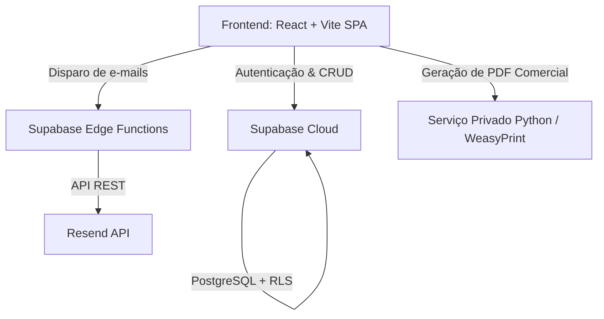

# Guia de Padronização Tecnológica (Stack Padrão PHD)

Este documento estabelece o **Guia de Padronização Tecnológica** para os desenvolvimentos internos da **PHD Engenharia**. O objetivo deste padrão é garantir consistência de código, acelerar a curva de aprendizado de novos desenvolvedores, simplificar a manutenção de sistemas e manter custos de infraestrutura extremamente otimizados.

---

## 🏛️ Visão Geral da Arquitetura Padrão

A PHD Engenharia adota a arquitetura de **Aplicações Desacopladas (Decoupled SPA / BaaS)**.
O frontend funciona de forma 100% estática e interage diretamente com um Backend como Serviço (BaaS), eliminando a necessidade de servidores web complexos rodando lógicas monolíticas de renderização.



---

## 🛠️ Lista de Ferramentas e Tecnologias Homologadas

| Categoria                       | Tecnologia Padrão                            | Justificativa Técnica                                                                                                                                               |
| :------------------------------ | :-------------------------------------------- | :------------------------------------------------------------------------------------------------------------------------------------------------------------------- |
| **Frontend Core**         | **React + Vite (SPA)**                  | Servidor de desenvolvimento instantâneo, excelente ecossistema de bibliotecas e compilação de produção extremamente otimizada.                                  |
| **Roteamento**            | **React Router DOM v6**                 | Padrão da indústria para navegação de páginas únicas (SPA), controle de histórico e bloqueios de rotas protegidas (RBAC).                                     |
| **Estilização**         | **Vanilla CSS Componentizado**          | Máximo desempenho, zero overhead de compilação, e total controle visual. Uso obrigatório de**CSS Custom Properties (Variables)** para o design system.     |
| **Ícones**               | **Lucide React**                        | Biblioteca de ícones moderna, leve, altamente customizável e com suporte completo a TypeScript/React.                                                              |
| **Banco de Dados & BaaS** | **Supabase (PostgreSQL)**               | Combina o poder relacional do PostgreSQL com facilidades serverless. Reduz custos de infraestrutura e o tempo de desenvolvimento em até 60%.                        |
| **Autenticação**        | **Supabase Auth (JWT)**                 | Autenticação pronta, segura e baseada em tokens JWT. Permite controle preciso de sessões e perfis de usuários.                                                   |
| **Segurança**            | **Row-Level Security (RLS)**            | Políticas de segurança escritas diretamente no PostgreSQL do Supabase. Garante que as permissões de acesso aos dados sejam validadas em nível de banco de dados. |
| **E-mail Transacional**   | **Resend API**                          | Entrega rápida, excelente painel de monitoramento, API REST moderna e excelente relação custo-benefício.                                                         |
| **Geração de PDFs**     | **WeasyPrint (Python Private)**         | Renderização perfeita de HTML/CSS para PDF. Muito superior a bibliotecas JavaScript para geração de relatórios e propostas visuais premium.                     |
| **Deploy / Infra**        | **Nginx em VPS (Hetzner/DigitalOcean)** | Distribuição estática extremamente rápida, baixo consumo de memória, custo previsível e segurança robusta através de HTTPS automático.                      |

---

## 🔍 Detalhamento das Ferramentas Homologadas

### 1. Frontend: React + Vite

* **Vantagem:** O Vite substitui o antigo padrão Webpack/Create React App. Ele utiliza ES Modules nativos no navegador durante o desenvolvimento, tornando o recarregamento de código (Hot Module Replacement) instantâneo.
* **Regra de Uso:** As aplicações devem ser estruturadas sob o padrão SPA (Single Page Application) estático, de modo que possam ser distribuídas globalmente por CDN ou servidores Nginx simples sem custo de processamento no servidor.

### 2. Estilização: Vanilla CSS (Zero Frameworks)

* **Vantagem:** Evitamos o uso de Tailwind CSS, Bootstrap ou CSS-in-JS (como styled-components). Isso garante que o sistema tenha carregamento ultra-rápido, livre de arquivos gigantes de terceiros, e mantém a equipe no controle total das animações e design premium.
* **Regra de Uso:** Todo estilo global deve seguir o padrão de tokens CSS criados no arquivo principal (como cores institucionais Terracotta, Ice White, Blue). Cada componente React deve carregar seu próprio arquivo CSS específico para evitar poluição visual.

### 3. Banco de Dados e Backend: Supabase (Serverless PostgreSQL)

* **Vantagem:** O Supabase fornece um banco de dados relacional PostgreSQL completo com APIs automáticas (REST e Realtime) geradas de forma instantânea sobre as tabelas físicas.
* **Regra de Uso:** É **obrigatório** habilitar RLS (Row-Level Security) em todas as tabelas criadas. O frontend faz chamadas diretas ao banco de dados utilizando a chave pública (`anon`), e a segurança dos dados de clientes e faturamento é garantida pelas políticas escritas no Postgres.

### 4. Geração de Documentos: WeasyPrint (Serviço Externo Python)

* **Vantagem:** Gerar PDFs elegantes (como as propostas comerciais da PHD) no frontend com JS costuma quebrar a paginação ou gerar arquivos de baixa qualidade. O WeasyPrint utiliza o motor de renderização de navegadores para transformar páginas HTML + CSS em PDFs com qualidade de impressão.
* **Regra de Uso:** O React envia o JSON de dados para um microsserviço Python privado, que faz o processamento pesado de renderização e retorna o documento perfeito em formato PDF.

### 5. Envio de E-mails: Resend API

* **Vantagem:** Simplifica drasticamente o envio de alertas automáticos e confirmações de propostas aos clientes, permitindo layouts em HTML limpos e integração direta através de Supabase Edge Functions.

---

## 🚀 Diretrizes para Novos Projetos na PHD

Para iniciar um novo desenvolvimento seguindo os padrões homologados acima, o fluxo deve sempre respeitar a seguinte arquitetura de desenvolvimento:

1. **Repositório Monorepo/Decoupled:** Separação rígida de responsabilidades. O código frontend não deve ter conhecimento de como o banco de dados é hospedado fisicamente, apenas consumindo as APIs REST/GraphQL.
2. **Setup Rápido:**
   ```bash
   # Criar o projeto React com Vite
   npm create vite@latest meu-novo-app -- --template react

   # Dependências padrão permitidas
   npm install @supabase/supabase-js react-router-dom lucide-react
   ```
3. **Padrão de Segurança (Segurança por Design):**
   * Chaves privadas (`service_role` ou senhas de banco) **nunca** podem ser expostas no código cliente (frontend).
   * Toda lógica restrita (como validações de descontos comerciais ou integrações de e-mail de terceiros) deve ser executada de forma serverless em **Supabase Edge Functions** ou microsserviços isolados de backend.
